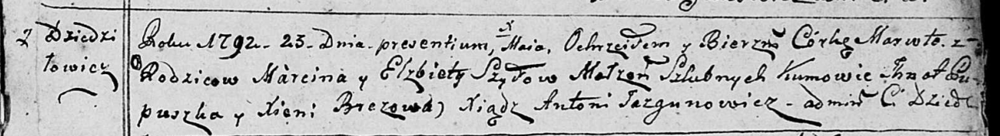

**Шило Марута Марцинова (Szyłowna Maruta)**

23 мая 1792 г -- крещение (НИАБ 136-13-894, лист 16, №27/1792-р (ориг)).

**НИАБ 136-13-894:** Лист 16. **Метрическая запись №27/1792-р (ориг).**

Дедиловичская Покровская церковь. 23 мая 1792 года. Метрическая запись о
крещении.

Szyłowna Maruta -- дочь родителей с деревни Дедиловичи.

Szyło Marcin -- отец.

Szyłowa Elżbieta -- мать.

Pupuszka Jhnat - кум.

Brezowa Xienia - кума.

Jazgunowicz Antoni -- ксёндз.
