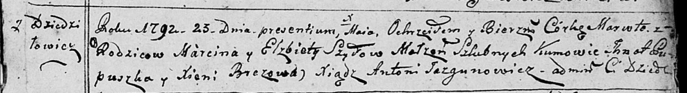
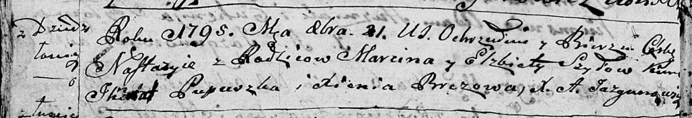

**Шило Марцин (Szyło Marcin)**

23 мая 1792 г -- крещение дочери Маруты (НИАБ 136-13-894, лист 16,
№27/1792-р (ориг)).

21 октября 1795 г -- крещение дочери Настасьи (НИАБ 136-13-894, лист
25об, №44/1795-р (ориг)).

**НИАБ 136-13-894:** Лист 16. **Метрическая запись №27/1792-р (ориг).**

Дедиловичская Покровская церковь. 23 мая 1792 года. Метрическая запись о
крещении.

Szyłowna Maruta -- дочь родителей с деревни Дедиловичи.

Szyło Marcin -- отец.

Szyłowa Elżbieta -- мать.

Pupuszka Jhnat - кум.

Brezowa Xienia - кума.

Jazgunowicz Antoni -- ксёндз.

**НИАБ 136-13-894:** Лист 25об. **Метрическая запись №44/1795-р
(ориг).**

Дедиловичская Покровская церковь. 21 октября 1795 года. Метрическая
запись о крещении.

Szyłowna Nastazyia -- дочь родителей с деревни Дедиловичи.

Szyło Marcin -- отец.

Szyłowa Elżbieta -- мать.

Pupuszka Jhnat - кум.

Brezowa Xienia - кума.

Jazgunowicz Antoni -- ксёндз.
