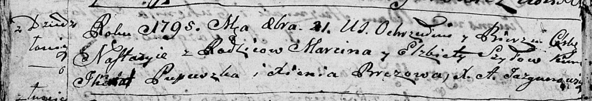

**Шило Настасия Марцинова (Szyłowna Nastazyia)**

21 октября 1795 г -- крещение (НИАБ 136-13-894, лист 25об, №44/1795-р
(ориг)).

**НИАБ 136-13-894:** Лист 25об. **Метрическая запись №44/1795-р
(ориг).**

{width="6.496527777777778in"
height="1.1123687664041995in"}

Дедиловичская Покровская церковь. 21 октября 1795 года. Метрическая
запись о крещении.

Szyłowna Nastazyia -- дочь родителей с деревни Дедиловичи.

Szyło Marcin -- отец.

Szyłowa Elżbieta -- мать.

Pupuszka Jhnat - кум.

Brezowa Xienia - кума.

Jazgunowicz Antoni -- ксёндз.
