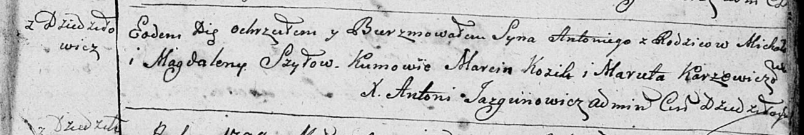

**Шило Антон Михасёв (Szyło Antoni)**

19 сентября 1798 г -- крещение (НИАБ 136-13-894, лист 37, №47/1798-р
(ориг)), (РГИА 823-2-18, лист 266об, №48/1798-р (коп)).

**НИАБ 136-13-894:** Лист 37. **Метрическая запись №47/1798-р (ориг).**

Дедиловичская Покровская церковь. 19 сентября 1798 года. Метрическая
запись о крещении.

Szyło Antoni -- сын родителей с деревни Дедиловичи.

Szyło Michal -- отец.

Szyłowa Magdalena -- мать.

Kozik Marcin - кум.

Karżewiczowa Maruta - кума.

Jazgunowicz Antoni -- ксёндз.

**РГИА 823-2-18:** Лист 266об. **Метрическая запись №48/1798-р (коп).**

Дедиловичская Покровская церковь. 19 сентября 1798 года. Метрическая
запись о крещении.

Szyło Antoni -- сын родителей с деревни Дедиловичи.

Szyło Michał -- отец.

Szyłowa Magdalena -- мать.

Kozik Marcin -- кум.

\[Karżewiczowa\] Maruta -- кума.

Jazgunowicz Antoni -- ксёндз.
