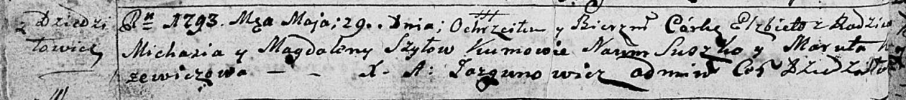
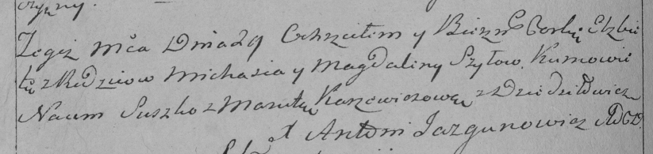
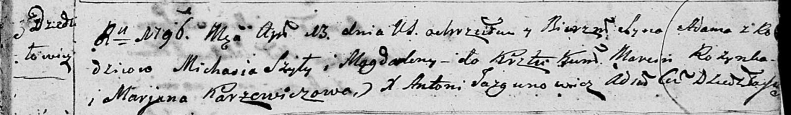
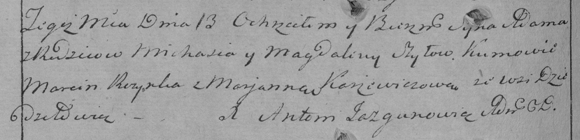
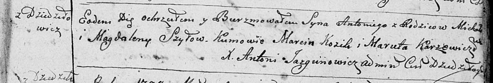
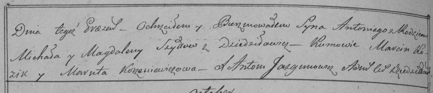

**Шило Магдалена (Szyłowa, Szydłanka Magdalena)**

29 мая 1793 г -- крещение дочери Елисаветы (НИАБ 136-13-894, лист 19об,
№45/1793-р (ориг)), (РГИА 823-2-18, лист 247об, №22/1793-р (коп)).

13 апреля 1796 г -- крещение сына Адама (НИАБ 136-13-894, лист 29,
№46/1796-р (ориг)), (РГИА 823-2-18, лист 255об, №22/1796-р (коп)).

19 сентября 1798 г -- крещение сына Антона (НИАБ 136-13-894, лист 37,
№47/1798-р (ориг)), (РГИА 823-2-18, лист 266об, №48/1798-р (коп)).

18 мая 1802 г -- крестная мать у Агнешки Домицели, дочери Захаревичей
Прокопа и Марьяны с деревни Дедиловичи (НИАБ 136-13-894, лист 46об,
№16/1802-р (ориг)).

**НИАБ 136-13-894:** Лист 19-об. **Метрическая запись №45/1793-р
(ориг).**

Дедиловичская Покровская церковь. 29 мая 1793 года. Метрическая запись о
крещении.

Szyłowna Elżbieta -- родителей с деревни Дедиловичи.

Szyło Michaś -- отец.

Szyłowa Magdalena -- мать.

Suszko Naum - кум.

Karżewiczowa Maruta - кума.

Jazgunowicz Antoni -- ксёндз.

**РГИА 823-2-18:** Лист 247об. **Метрическая запись №22/1793-р (коп).**

Дедиловичская Покровская церковь. 29 мая 1793 года. Метрическая запись о
крещении.

Szyłowna Elżbieta -- дочь родителей с деревни Дедиловичи.

Szyło Michaś -- отец.

Szyłowa Magdalena -- мать.

Suszko Naum -- кум.

Karżewiczowa Maruta -- кума.

Jazgunowicz Antoni -- ксёндз.

**НИАБ 136-13-894:** Лист 29. **Метрическая запись №46/1796-р (ориг).**

Дедиловичская Покровская церковь. 13 апреля 1796 года. Метрическая
запись о крещении.

Szyło Adam -- сын родителей с деревни Дедиловичи.

Szyło Michał -- отец.

Szyło Magdalena -- мать.

Rozynko Marcin - кум.

Karżewiczowa Marjana - кума.

Jazgunowicz Antoni -- ксёндз, проводивший таинства, администратор
церкви.

**РГИА 823-2-18:** Лист 255об. **Метрическая запись №22/1796-р (коп).**

Дедиловичская Покровская церковь. 13 апреля 1796 года. Метрическая
запись о крещении.

Szyło Adam -- сын родителей с деревни Дедиловичи.

Szyło Michaś -- отец.

Szyłowa Magdalena -- мать.

Rozynka Marcin -- кум.

Korżewiczowa Marjanna -- кума.

Jazgunowicz Antoni -- ксёндз.

**НИАБ 136-13-894:** Лист 37. **Метрическая запись №47/1798-р (ориг).**

Дедиловичская Покровская церковь. 19 сентября 1798 года. Метрическая
запись о крещении.

Szyło Antoni -- сын родителей с деревни Дедиловичи.

Szyło Michal -- отец.

Szyłowa Magdalena -- мать.

Kozik Marcin - кум.

Karżewiczowa Maruta - кума.

Jazgunowicz Antoni -- ксёндз.

**РГИА 823-2-18:** Лист 266об. **Метрическая запись №48/1798-р (коп).**

Дедиловичская Покровская церковь. 19 сентября 1798 года. Метрическая
запись о крещении.

Szyło Antoni -- сын родителей с деревни Дедиловичи.

Szyło Michał -- отец.

Szyłowa Magdalena -- мать.

Kozik Marcin -- кум.

\[Karżewiczowa\] Maruta -- кума.

Jazgunowicz Antoni -- ксёндз.

**НИАБ 136-13-894:** Лист 46об. **Метрическая запись №16/1802-р
(ориг).**

Дедиловичская Покровская церковь. 18 мая 1802 года. Метрическая запись о
крещении.

Zacharewiczowna Agnieszka Domicella -- дочь родителей с деревни
Дедиловичи.

Zacharewicz Prokop -- отец.

Zacharewiczowa Marjana -- мать.

Wasilewski Jan -- кум, с деревни Дедиловичи.

Szydłanko Magdalena -- кума, с деревни Дедиловичи.

Jazgunowicz Antoni -- ксёндз.
