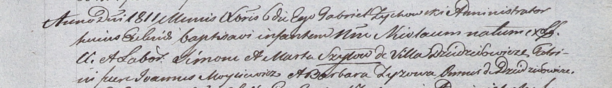

**Шило Николай Сымонов (Szyło Nicołaus)**

6 ноября 1811 г -- крещение (НИАБ 937-4-32, лист 24, №22/1811-р).

**НИАБ 937-4-32:** Лист 24. **Метрическая запись №22/1811-р.**

{width="6.496527777777778in"
height="0.9388888888888889in"}

Дедиловичский костел Наисвятейшего Сердца Иисуса. 6 декабря 1811 года.
Метрическая запись о крещении.

Szyło Nicołaus -- сын крестьян с деревни Дедиловичи.

Szyło Simon -- отец.

Szyłowa Marta -- мать.

Moysiewicz Joannus -- крестный отец, с деревни Дедиловичи.

Zyzowa Barbara -- крестная мать, с деревни Дедиловичи.

Zychowski Gabriel -- ксёндз.
