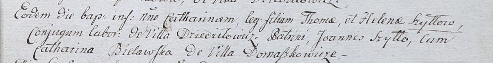

**Шило Елена (Szyłowa Helena)**

23 марта 1802 г -- крещение дочери Катарины (НИАБ 937-4-32, лист 6,
№7/1802-р).

**НИАБ 937-4-32:** Лист 6. **Метрическая запись №7/1802-р.**

{width="6.496527777777778in"
height="0.84375in"}

Дедиловичский костел Наисвятейшего Сердца Иисуса. 23 марта 1802 года.
Метрическая запись о крещении.

Szyłłowna Catharina -- дочь крестьян с деревни Дедиловичи.

Szyłło Thoma -- отец.

Szyłłowa Helena -- мать.

Szyłło Joann -- крестный отец.

Bielawska Catharina -- крестная мать, с деревни Домашковичи.

Linhart Hyacinthus -- ксёндз.
