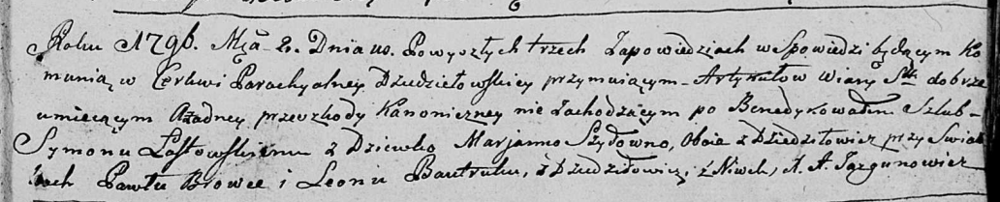

**Шило Авхиня (Szyłowa Auchinia)**

18 октября 1800 г -- крестная мать Луки, сына Василя и Тодоры Слёзков с
деревни Дедиловичи (НИАБ 937-4-32, лист 3, №35/1800-р).

**НИАБ 937-4-32:** Лист 3. **Метрическая запись №35/1800-р.**

Дедиловичский костел Наисвятейшего Сердца Иисуса. 18 октября 1800 года.
Метрическая запись о крещении.

{width="6.496527777777778in"
height="0.6354166666666666in"}

Slozka Łuca -- сын крестьян с деревни Дедиловичи.

Slozka Basili -- отец.

Slozkowa Chwiedora -- мать.

Szyło Joann -- крестный отец, с деревни Дедиловичи.

Szyłowa Auchinia -- крестная мать, с деревни Дедиловичи.

Linhart Hyacinthus -- ксёндз.
