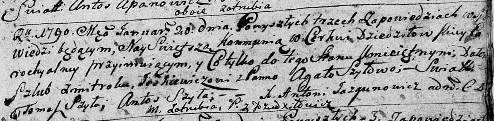

**Шило (Еськевич) Агата (Jeśkiewiczowa Agata z Szyłow)**

20 января 1790 г -- венчание со Змитроком Еськевичем с деревни Отруб
(НИАБ 136-13-894, лист 68, №1/1790-б (ориг)).

**НИАБ 136-13-894:** Лист 68. **Метрическая запись №1/1790-б (ориг).**

Дедиловичская Покровская церковь. 20 января 1790 года. Метрическая
запись о венчании.

Jeśkiewicz Zmitrok -- жених, с деревни Отруб.

Szyłowa Agata -- невеста, с деревни Дедиловичи.

Szyło Tomasz -- свидетель.

Szyło Antoś -- свидетель.

Jazgunowicz Antoni -- ксёндз.
