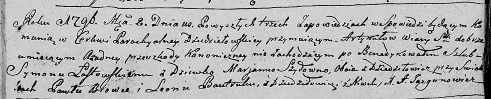

**Каржевич (Шило) Анна (Karżewiczowa Anna z Szył)**

18 апреля 1795 г -- венчание с Яном Каржевичем с деревни Дедиловичи
(НИАБ 136-13-920, лист 2, №3/1795-б (ориг)).

**НИАБ 136-13-920:** Лист 2. **Метрическая запись №3/1795-б (ориг).**

{width="6.496527777777778in"
height="1.236411854768154in"}

Дедиловичская Покровская церковь. 18 апреля 1795 года. Метрическая
запись о венчании.

Karżewicz Jan -- жених, деревня Дедиловичи.

Szyłanko Anna -- невеста, девка, деревня Дедиловичи.

Szyło Leon -- свидетель.

Szyło Stanisław -- свидетель.

Jazgunowicz Antoni -- ксёндз.
