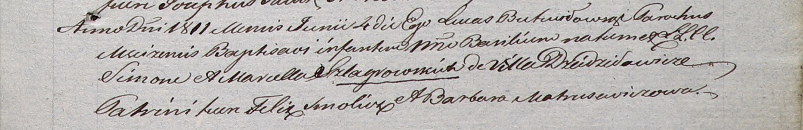

**Шлягровская Марцеля (Szlagrowska Marcella)**

4 июня 1811 г -- крещение сына Базыля (НИАБ 937-4-32, лист 23,
№9/1811-р).

**НИАБ 937-4-32:** Лист 23. **Метрическая запись №9/1811-р.**

{width="6.496527777777778in"
height="1.0527777777777778in"}

Дедиловичский костел Наисвятейшего Сердца Иисуса. 4 июня 1811 года.
Метрическая запись о крещении.

Szlagrowski Basili -- сын родителей с деревни Дедиловичи.

Szlagrowski Simon -- отец.

Szlagrowska Marcella -- мать.

Smolicz Felix -- крестный отец.

Matrusewiczowa Barbara -- крестная мать.

Butwiłowski Łukas -- ксёндз, администратор Мстижский.
