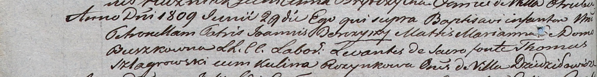

**Шлягровский Томаш (Szlagrowski Thomas)**

29 июня 1809 г -- крестный отец Петронели, дочери Яна и Марьяны Борейшов
с деревни Дедиловичи (НИАБ 937-4-32, лист 19об, №19/1809-р).

**НИАБ 937-4-32:** Лист 19об. **Метрическая запись №19/1809-р.**

{width="6.496527777777778in"
height="0.8506944444444444in"}

Дедиловичский костел Наисвятейшего Сердца Иисуса. 29 июня 1809 года.
Метрическая запись о крещении.

Berczyszowa Petronella -- дочь крестьян с деревни Дедиловичи.

Berczysz Joann -- отец.

Berczyszowa Marianna -- мать.

Szlagrowski Thomas -- крестный отец, с деревни Дедиловичи.

Rozynkowa Kulina -- крестная мать, с деревни Дедиловичи.

Miszkun Marcus -- ксёндз.
