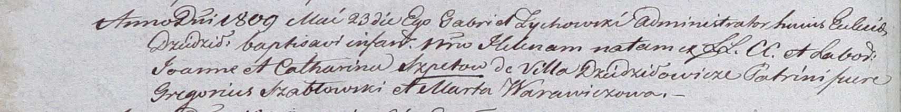

**Шпет Елена Иоаннова (Szpetowna Helena)**

23 мая 1809 г -- крещение (НИАБ 937-4-32, лист 19об, №12/1809-р).

**НИАБ 937-4-32:** Лист 19об. **Метрическая запись №12/1809-р.**

Дедиловичский костел Наисвятейшего Сердца Иисуса. 23 мая 1809 года.
Метрическая запись о крещении.

Szpetowna Helena -- дочь крестьян с деревни Дедиловичи.

Szpet Joann -- отец.

Szpetowa Catharina -- мать.

Szabłowski Gregorius -- крестный отец.

Warawiczowa Marta -- крестная мать.

Zychowski Gabriel -- ксёндз.
