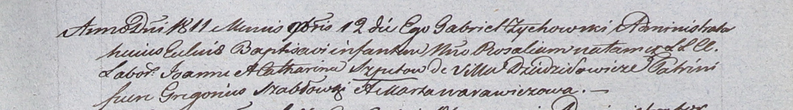

**Шпет Иоанн (Szpet Joann)**

17 марта 1807 г -- крещение сына Казимира (НИАБ 937-4-32, лист 15,
№6/1807-р).

23 мая 1809 г -- крещение дочери Елены (НИАБ 937-4-32, лист 19об,
№12/1809-р).

12 ноября 1811 г -- крещение дочери Розалии (НИАБ 937-4-32, лист 24,
№20/1811-р).

**НИАБ 937-4-32:** Лист 15. **Метрическая запись №6/1807-р.**

{width="6.496527777777778in"
height="1.9381944444444446in"}

Дедиловичский костел Наисвятейшего Сердца Иисуса. 17 марта 1807 года.
Метрическая запись о крещении.

Szpet Casimir -- сын крестьян с деревни Дедиловичи.

Szpet Joann -- отец.

Szpetowa Catharina -- мать.

Wasilewski Joann -- крестный отец.

Warawiczowa Marta -- крестная мать, с деревни Дедиловичи.

Skindzelewski Andreas -- ксёндз, комендант Дедиловичский.

**НИАБ 937-4-32:** Лист 19об. **Метрическая запись №12/1809-р.**

{width="6.496527777777778in"
height="0.8131944444444444in"}

Дедиловичский костел Наисвятейшего Сердца Иисуса. 23 мая 1809 года.
Метрическая запись о крещении.

Szpetowna Helena -- дочь крестьян с деревни Дедиловичи.

Szpet Joann -- отец.

Szpetowa Catharina -- мать.

Szabłowski Gregorius -- крестный отец.

Warawiczowa Marta -- крестная мать.

Zychowski Gabriel -- ксёндз.

**НИАБ 937-4-32:** Лист 24. **Метрическая запись №20/1811-р.**

{width="6.496527777777778in"
height="0.9069444444444444in"}

Дедиловичский костел Наисвятейшего Сердца Иисуса. 12 ноября 1811 года.
Метрическая запись о крещении.

Szpetowna Rosalia -- дочь крестьян с деревни Дедиловичи.

Szpet Joann -- отец.

Szpetowa Catharina -- мать.

Szabłowski Gregorius -- крестный отец.

Warawiczowa Marta -- крестная мать.

Zychowski Gabriel -- ксёндз.
