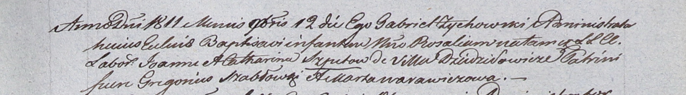

**Шпет Розалия Иоаннова (Szpetowna Rosalia)**

12 ноября 1811 г -- крещение (НИАБ 937-4-32, лист 24, №20/1811-р).

**НИАБ 937-4-32:** Лист 24. **Метрическая запись №20/1811-р.**

Дедиловичский костел Наисвятейшего Сердца Иисуса. 12 ноября 1811 года.
Метрическая запись о крещении.

Szpetowna Rosalia -- дочь крестьян с деревни Дедиловичи.

Szpet Joann -- отец.

Szpetowa Catharina -- мать.

Szabłowski Gregorius -- крестный отец.

Warawiczowa Marta -- крестная мать.

Zychowski Gabriel -- ксёндз.
