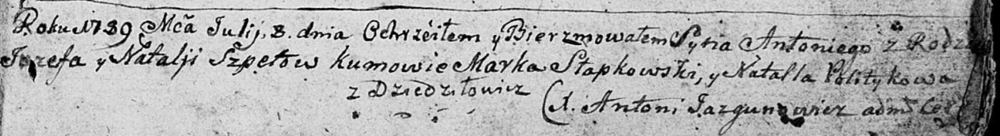
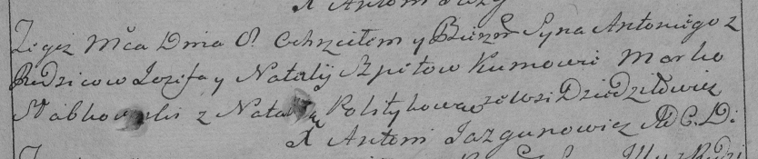

**Шпет Антон Иосифов (Szpet Antonij)**

8 июля 1789 г -- крещение (НИАБ 136-13-894, лист 7, №35/1789-р (ориг)),
(РГИА 823-2-18, лист 238, №15/1789-р (коп))

**НИАБ 136-13-894:** Лист 7. **Метрическая запись №35/1789-р (ориг).**

Дедиловичская Покровская церковь. 8 июля 1789 года. Метрическая запись о
крещении.

Szpet Antonij -- сын родителей с деревни Дедиловичи.

Szpet Jozef -- отец.

Szpetowa Natalja -- мать.

Słapkowski Marka - кум.

Politykowa Natalla - кума.

Jazgunowicz Antoni -- ксёндз.

**РГИА 823-2-18:** Лист 238. **Метрическая запись №16/1789-р (коп).**

Дедиловичская Покровская церковь. 8 июля 1789 года. Метрическая запись о
крещении.

Szpet Antoni -- сын родителей с деревни Дедиловичи.

Szpet Jozef -- отец.

Szpetowa Natalija -- мать.

Słabkowski Marko -- кум.

Politykowa Natalla - кума.

Jazgunowicz Antoni -- ксёндз.
