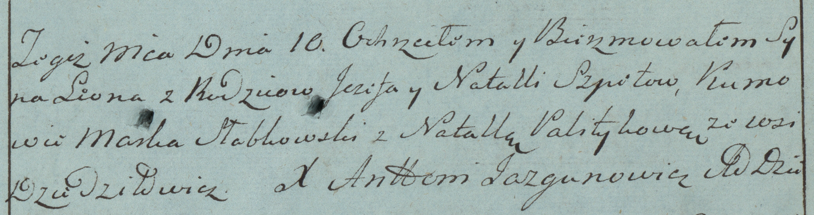

**Шпет Леон Иосифов (Szpet Leon)**

10 марта 1784 г -- крещение (РГИА 823-2-18, лист 226, №8/1784-р (коп)).

**РГИА 823-2-18:** Лист 226. **Метрическая запись №8/1784-р (коп).**

Дедиловичская Покровская церковь. 10 марта 1784 года. Метрическая запись
о крещении.

Szpet Leon -- сын родителей с деревни Дедиловичи.

Szpet Jezef -- отец.

Szpetowa Natalla -- мать.

Słabkowski Marka -- кум.

Palitykowa Natalla - кума.

Jazgunowicz Antoni -- ксёндз.
