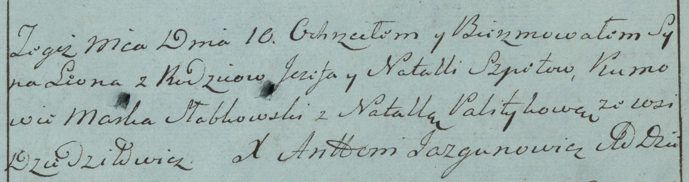

**Шпет Магдалена Иосифова (Szpetowa Magdalena)**

29 июня 1792 г -- крещение (НИАБ 136-13-894, лист 16об, №39/1789-р
(ориг))

Лист 16об. **Метрическая запись №39/1792-р (ориг).**

{width="6.496527777777778in"
height="0.8656222659667542in"}

Дедиловичская Покровская церковь. 29 июня 1792 года. Метрическая запись
о крещении.

Szpetowna Magdalena -- дочь родителей с деревни Дедиловичи.

Szpet Jozef -- отец.

Szpetowa Natalla -- мать.

Słapkowski Marko - кум.

Sawicka Marta - кума.

Jazgunowicz Antoni -- ксёндз.
