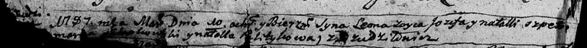

**Шпет Наталья (Szpetowa Natalla, Natalja)**

10 марта 1784 г -- крещение сына Леона (РГИА 823-2-18, лист 226,
№8/1784-р (коп)).

25 мая 1785 г -- крещение сына Сымона (РГИА 823-2-18, лист 229,
№14/1785-р (коп)).

10 мая 1787 г -- крещение сына Леона младшего (НИАБ 136-13-894, лист
1об, №20/1787-р (ориг))

8 июля 1789 г -- крещение сына Антона (НИАБ 136-13-894, лист 7,
№35/1789-р (ориг)), (РГИА 823-2-18, лист 238, №15/1789-р (коп))

29 июня 1792 г -- крещение дочери Магдалены (НИАБ 136-13-894, лист 16об,
№39/1789-р (ориг))

**РГИА 823-2-18:** Лист 226. **Метрическая запись №8/1784-р (коп).**

{width="6.496527777777778in"
height="1.7222222222222223in"}

Дедиловичская Покровская церковь. 10 марта 1784 года. Метрическая запись
о крещении.

Szpet Leon -- сын родителей с деревни Дедиловичи.

Szpet Jezef -- отец.

Szpetowa Natalla -- мать.

Słabkowski Marka -- кум.

Palitykowa Natalla - кума.

Jazgunowicz Antoni -- ксёндз.

**РГИА 823-2-18:** Лист 229. **Метрическая запись №14/1785-р (коп).**

{width="6.496527777777778in"
height="1.6493055555555556in"}

Дедиловичская Покровская церковь. 25 мая 1785 года. Метрическая запись о
крещении.

Szpet Symon -- сын родителей с деревни Дедиловичи.

Szpet Jezef -- отец.

Szpetowa Natalla -- мать.

Słabkowski Marko -- кум.

Polityczyna Natalla - кума.

Jazgunowicz Antoni -- ксёндз.

**НИАБ 136-13-894:** Лист 1об. **Метрическая запись №20/1787-р (ориг).**

{width="6.496527777777778in"
height="0.5330522747156605in"}

Дедиловичская Покровская церковь. 10 мая 1787 года. Метрическая запись о
крещении.

Szpet Leon (второй) - сын родителей с деревни Дедиловичи.

Szpet Jozef -- отец.

Szpetowa Natalla -- мать.

Słabkowski Mark? - кум.

Politykowa Natalla - кума.

Jazgunowicz Antoniusz -- ксёндз.

**НИАБ 136-13-894:** Лист 7. **Метрическая запись №35/1789-р (ориг).**

{width="6.496527777777778in"
height="0.8837259405074366in"}

Дедиловичская Покровская церковь. 8 июля 1789 года. Метрическая запись о
крещении.

Szpet Antonij -- сын родителей с деревни Дедиловичи.

Szpet Jozef -- отец.

Szpetowa Natalja -- мать.

Słapkowski Marka - кум.

Politykowa Natalla - кума.

Jazgunowicz Antoni -- ксёндз.

**РГИА 823-2-18:** Лист 238. **Метрическая запись №16/1789-р (коп).**

{width="6.496527777777778in"
height="1.3631944444444444in"}

Дедиловичская Покровская церковь. 8 июля 1789 года. Метрическая запись о
крещении.

Szpet Antoni -- сын родителей с деревни Дедиловичи.

Szpet Jozef -- отец.

Szpetowa Natalija -- мать.

Słabkowski Marko -- кум.

Politykowa Natalla - кума.

Jazgunowicz Antoni -- ксёндз.

Лист 16об. **Метрическая запись №39/1792-р (ориг).**

{width="6.496527777777778in"
height="0.8656222659667542in"}

Дедиловичская Покровская церковь. 29 июня 1792 года. Метрическая запись
о крещении.

Szpetowna Magdalena -- дочь родителей с деревни Дедиловичи.

Szpet Jozef -- отец.

Szpetowa Natalla -- мать.

Słapkowski Marko - кум.

Sawicka Marta - кума.

Jazgunowicz Antoni -- ксёндз.
