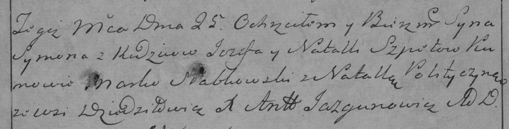

**Шпет Сымон Иосифов (Szpet Symon)**

25 мая 1785 г -- крещение сына Сымона (РГИА 823-2-18, лист 229,
№14/1785-р (коп)).

**РГИА 823-2-18:** Лист 229. **Метрическая запись №14/1785-р (коп).**

Дедиловичская Покровская церковь. 25 мая 1785 года. Метрическая запись о
крещении.

Szpet Symon -- сын родителей с деревни Дедиловичи.

Szpet Jezef -- отец.

Szpetowa Natalla -- мать.

Słabkowski Marko -- кум.

Polityczyna Natalla - кума.

Jazgunowicz Antoni -- ксёндз.
