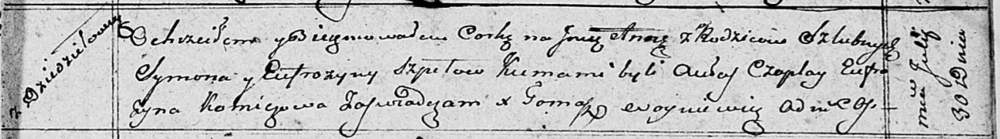

**Шпет Анна Сымонова (Szpetowna Anna)**

30 июля 1810 г -- крещение (НИАБ 136-13-894, лист 78, №31/1810-р
(ориг)).

**НИАБ 136-13-894:** Лист 78. **Метрическая запись №31/1810-р (ориг).**

{width="6.496527777777778in"
height="0.9085345581802274in"}

Осовская Покровская церковь. 30 июля 1810 года. Метрическая запись о
крещении.

Szpetowna Anna -- дочь родителей с деревни Дедиловичи.

Szpet Symon -- отец.

Szpetowa Eufrozyna -- мать.

Czaplay Aulas -- кум.

Komiczowa Eufrozyna -- кума.

Woyniewicz Tomasz -- ксёндз.
