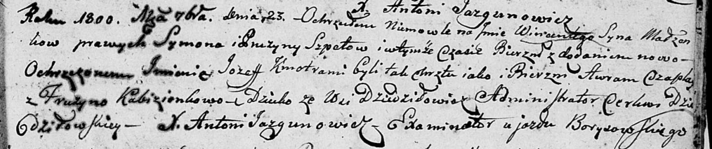
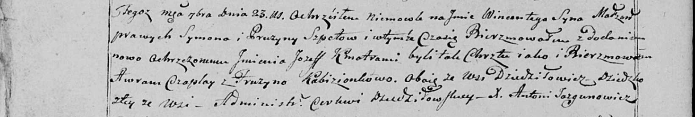

**Шпет Винцент Сымонов (Szpet Wincenty Jozef)**

23 сентября 1800 г -- крещение (НИАБ 136-13-894, лист 42, №26/1800-р
(ориг), НИАБ 136-13-949, лист 103об, №29/1800-р (коп)).

**НИАБ 136-13-894:** Лист 42. **Метрическая запись №26/1800-р (ориг).**

Дедиловичская Покровская церковь. 23 сентября 1800 года. Метрическая
запись о крещении.

Szpet Wincenty Jozef -- сын родителей с деревни Дедиловичи.

Szpet Symon -- отец.

Szpetowa Pruzyna -- мать.

Czaplay Awram -- кум.

Kabizionkowa Fruzyna -- кума.

Jazgunowicz Antoni -- ксёндз.

**НИАБ 136-13-949:** Лист 103об. **Метрическая запись №29/1800-р
(коп).**

(См. тж.: НИАБ 136-13-894, лист 42, №26/1800-р (ориг))

Дедиловичская Покровская церковь. 23 сентября 1800 года. Метрическая
запись о крещении.

Szpet Wincenty Jozef -- сын родителей с деревни Дедиловичи.

Szpet Symon -- отец.

Szpetowa Pruzyna -- мать.

Czaplay Awram -- кум, с деревни Дедиловичи.

Kabizionkowa Fruzyna - кума, с деревни Дедиловичи.

Jazgunowicz Antoni -- ксёндз.
