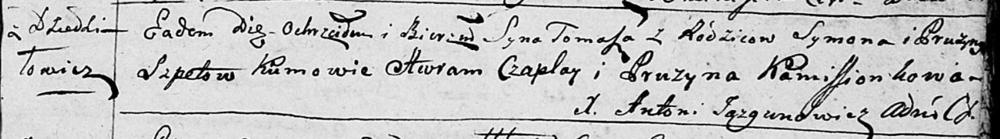
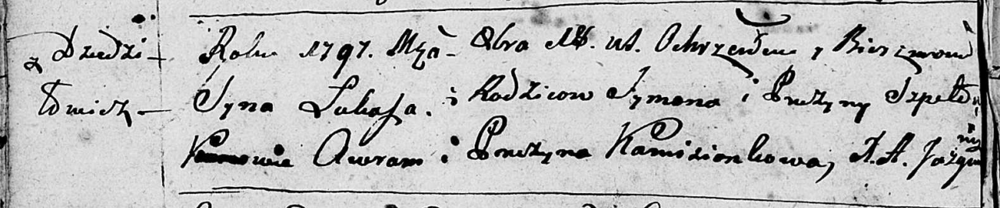
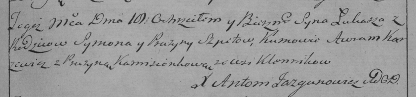

**Шпет Лука Сымонов (Szped Łukasz)**

18 октября 1797 г -- крещение (НИАБ 136-13-894, лист 34об, №61/1797-р
(ориг)), (РГИА 823-2-18, лист 261, №42/1797-р (коп)).

**НИАБ 136-13-894:** Лист 31. **Метрическая запись №87/1796-р (ориг).**

Дедиловичская Покровская церковь. 12 октября 1796 года. Метрическая
запись о крещении.

Szpet Tomasz -- сын родителей с деревни Дедиловичи.

Szpet Symon -- отец.

Szpetowa Pruzyna -- мать.

Czaplay Awram -- кум.

Kamisionkowa Pruzyna - кума.

Jazgunowicz Antoni -- ксёндз.

**НИАБ 136-13-894:** Лист 34об. **Метрическая запись №61/1797-р
(ориг).**

Дедиловичская Покровская церковь. 18 октября 1797 года. Метрическая
запись о крещении.

Szped Łukasz -- сын родителей с деревни Дедиловичи.

Szped Symon -- отец.

Szpedowa Pruzyna -- мать.

Awram - кум.

Kamzionkowa Pruzyna - кума.

Jazgunowicz Antoni -- ксёндз.

**РГИА 823-2-18:** Лист 261. **Метрическая запись №42/1797-р (коп).**

Дедиловичская Покровская церковь. 18 октября 1797 года. Метрическая
запись о крещении.

Szpet Łukasz -- сын родителей с деревни \[Дедиловичи\].

Szpet Symon -- отец.

Szpetowa Pruzyna -- мать.

Karżewicz Awram -- кум.

Kamisionkowa Pruzyna -- кума.

Jazgunowicz Antoni -- ксёндз.
