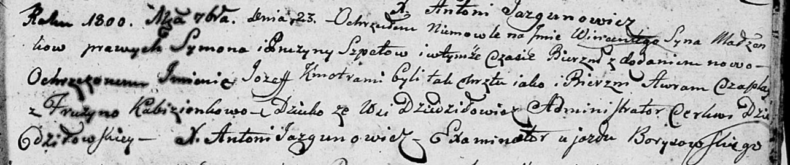
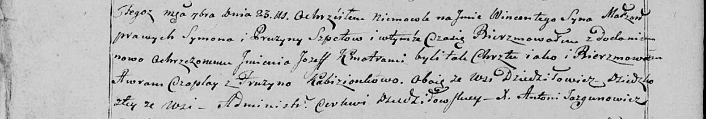
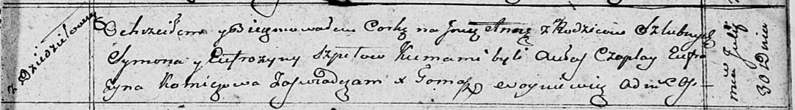

**Шпет Сымон (Szpet, Szped Symon)**

11 ноября 1795 г -- венчание с Фрузыной Слёзкой с деревни Дедиловичи
(НИАБ 136-13-920, лист 2об, №8/1795-б (ориг)).

12 октября 1796 г -- крещение сына Хомы (НИАБ 136-13-894, лист 30,
№87/1796-р (ориг)), (РГИА 823-2-18, лист 257об, №51/1796-р (коп)).

18 октября 1797 г -- крещение сына Луки (НИАБ 136-13-894, лист 34об,
№61/1797-р (ориг)), (РГИА 823-2-18, лист 261, №42/1797-р (коп)).

23 сентября 1800 г -- крещение сына Винцента Иосифа (НИАБ 136-13-894,
лист 42, №26/1800-р (ориг), НИАБ 136-13-949, лист 103об, №29/1800-р
(коп)).

4 апреля 1803 г -- крещение дочери Софьи Магдалены (НИАБ 136-13-894,
лист 50, №11/1803-р (ориг)).

15 апреля 1806 г -- крещение сына Мацея (НИАБ 136-13-894, лист 60,
№17/1806-р (ориг)).

30 июля 1810 г -- крещение дочери Анны (НИАБ 136-13-894, лист 78,
№31/1810-р (ориг)).

**НИАБ 136-13-920:** Лист 2об. **Метрическая запись №8/1795-б (ориг).**

Дедиловичская Покровская церковь. 11 ноября 1795 года. Метрическая
запись о венчании.

Szpet Symon -- жених, деревня Дедиловичи.

Słoskowa Fruzyna -- невеста, деревня Дедиловичи.

Pupuszka Mikołay -- свидетель, деревня Дедиловичи.

Szyło Chwiedor -- свидетель.

Jazgunowicz Antoni -- ксёндз.

**НИАБ 136-13-894:** Лист 31. **Метрическая запись №87/1796-р (ориг).**

Дедиловичская Покровская церковь. 12 октября 1796 года. Метрическая
запись о крещении.

Szpet Tomasz -- сын родителей с деревни Дедиловичи.

Szpet Symon -- отец.

Szpetowa Pruzyna -- мать.

Czaplay Awram -- кум.

Kamisionkowa Pruzyna - кума.

Jazgunowicz Antoni -- ксёндз.

**РГИА 823-2-18:** Лист 257об. **Метрическая запись №51/1796-р (коп).**

Дедиловичская Покровская церковь. 12 октября 1796 года. Метрическая
запись о крещении.

Szpet \[Tomasz\] -- сын родителей с деревни \[Дедиловичи\].

Szpet Symon -- отец.

Szpetowa Fruzyna -- мать.

Czaplay Awram -- кум.

Komisionkowa Pruzyna -- кума.

Jazgunowicz Antoni -- ксёндз.

**НИАБ 136-13-894:** Лист 34об. **Метрическая запись №61/1797-р
(ориг).**

Дедиловичская Покровская церковь. 18 октября 1797 года. Метрическая
запись о крещении.

Szped Łukasz -- сын родителей с деревни Дедиловичи.

Szped Symon -- отец.

Szpedowa Pruzyna -- мать.

Awram - кум.

Kamzionkowa Pruzyna - кума.

Jazgunowicz Antoni -- ксёндз.

**РГИА 823-2-18:** Лист 261. **Метрическая запись №42/1797-р (коп).**

Дедиловичская Покровская церковь. 18 октября 1797 года. Метрическая
запись о крещении.

Szpet Łukasz -- сын родителей с деревни \[Дедиловичи\].

Szpet Symon -- отец.

Szpetowa Pruzyna -- мать.

Karżewicz Awram -- кум.

Kamisionkowa Pruzyna -- кума.

Jazgunowicz Antoni -- ксёндз.

**НИАБ 136-13-894:** Лист 42. **Метрическая запись №26/1800-р (ориг).**

Дедиловичская Покровская церковь. 23 сентября 1800 года. Метрическая
запись о крещении.

Szpet Wincenty Jozef -- сын родителей с деревни Дедиловичи.

Szpet Symon -- отец.

Szpetowa Pruzyna -- мать.

Czaplay Awram -- кум.

Kabizionkowa Fruzyna -- кума.

Jazgunowicz Antoni -- ксёндз.

**НИАБ 136-13-949:** Лист 103об. **Метрическая запись №29/1800-р
(коп).**

(См. тж.: НИАБ 136-13-894, лист 42, №26/1800-р (ориг))

Дедиловичская Покровская церковь. 23 сентября 1800 года. Метрическая
запись о крещении.

Szpet Wincenty Jozef -- сын родителей с деревни Дедиловичи.

Szpet Symon -- отец.

Szpetowa Pruzyna -- мать.

Czaplay Awram -- кум, с деревни Дедиловичи.

Kabizionkowa Fruzyna - кума, с деревни Дедиловичи.

Jazgunowicz Antoni -- ксёндз.

**НИАБ 136-13-894:** Лист 50. **Метрическая запись №11/1803-р (ориг).**

Дедиловичская Покровская церковь. 4 апреля 1803 года. Метрическая запись
о крещении.

Szpetowna Zofia Magdalena -- дочь родителей с деревни Дедиловичи.

Szpet Symon -- отец.

Szpetowa Fruzyna -- мать.

Awram -- кум.

Kamisionkowa Pruzyna -- кума.

Jazgunowicz Antoni -- ксёндз.

**НИАБ 136-13-894:** Лист 60. **Метрическая запись №17/1806-р (ориг).**

Дедиловичская Покровская церковь. 15 апреля 1806 года. Метрическая
запись о крещении.

Szpet Maciey -- сын родителей с деревни Дедиловичи.

Szpet Symon -- отец.

Szpetowa Pruzyna -- мать.

Czaplay Awram -- кум.

Kamisionkowa Pruzyna -- кума.

Jazgunowicz Antoni -- ксёндз.

**НИАБ 136-13-894:** Лист 78. **Метрическая запись №31/1810-р (ориг).**

Осовская Покровская церковь. 30 июля 1810 года. Метрическая запись о
крещении.

Szpetowna Anna -- дочь родителей с деревни Дедиловичи.

Szpet Symon -- отец.

Szpetowa Eufrozyna -- мать.

Czaplay Aulas -- кум.

Komiczowa Eufrozyna -- кума.

Woyniewicz Tomasz -- ксёндз.
