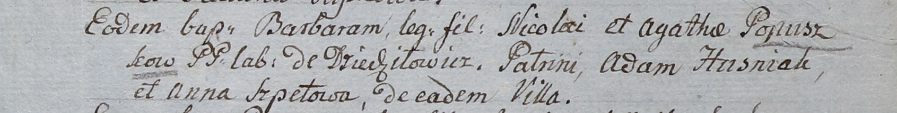

**Шпет (Варавич) Евгения (Warawiczowa Euhenia z Szpetow)**

13 ноября 1793 г -- венчание с Андреем Варавичем со двора Дедиловичи
(НИАБ 136-13-894, лист 72, №8/1793-б (ориг)).

**НИАБ 136-13-894:** Лист 72. **Метрическая запись №8/1793-б (ориг).**

{width="6.496527777777778in"
height="0.9138987314085739in"}

Дедиловичская Покровская церковь. 13 ноября 1793 года. Метрическая
запись о венчании.

Warawicz Andrzey -- жених, со двора Дедиловичи.

Szpetowna Euhenia -- невеста, с деревни Дедиловичи.

Szyło Janka -- свидетель.

Browka Paweł -- свидетель.

Jazgunowicz Antoni -- ксёндз.
