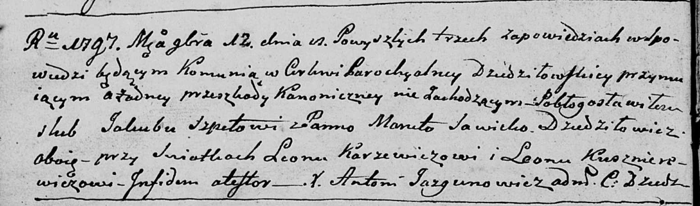
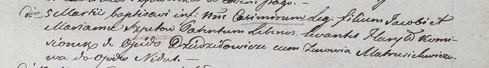
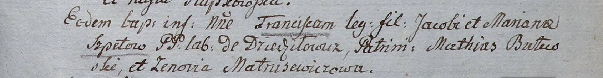
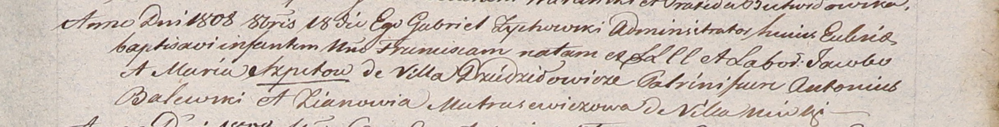

**Шпет Якуб (Szpet Jakub, Jakob)**

12 ноября 1797 г -- венчание с Марутой Савицкой с деревни Дедиловичи
(НИАБ 136-13-920, лист 4об, №10/1797-б (ориг)).

5 марта 1803 г -- крещение сына Казимира (НИАБ 937-4-32, лист 9,
№6/1803-р).

3 сентября 1805 г -- крещение сына Франциска (НИАБ 937-4-32, лист 12,
№35/1805-р).

18 октября 1808 г -- крещение дочери Франциски (НИАБ 937-4-32, лист 19,
№26/1808-р).

**НИАБ 136-13-920:** Лист 4об. **Метрическая запись №10/1797-б (ориг).**

Дедиловичская Покровская церковь. 12 ноября 1797 года. Метрическая
запись о венчании.

Szpet Jakub -- жених, с деревни Дедиловичи.

Sawicka Maruta -- невеста, с деревни Дедиловичи.

Karżewicz Leon -- свидетель.

Kusznierewicz Leon -- свидетель.

Jazgunowicz Antoni -- ксёндз.

**НИАБ 937-4-32:** Лист 9. **Метрическая запись №6/1803-р.**

Дедиловичский костел Наисвятейшего Сердца Иисуса. 5 марта 1803 года.
Метрическая запись о крещении.

Szpet Casimir -- сын вольных людей с деревни \[Дедиловичи\].

Szpet Jakob -- отец.

Szpetowa Mariana -- мать.

Kamisionek Hauryło -- крестный отец, с деревни Дедиловичи.

Matrusichwiczowa Zenowia -- крестная мать, с деревни Недаль.

Linhart Hyacinthus -- ксёндз.

**НИАБ 937-4-32:** Лист 12. **Метрическая запись №35/1805-р.**

Дедиловичский костел Наисвятейшего Сердца Иисуса. 3 сентября 1805 года.
Метрическая запись о крещении.

Szpetowna Francisc -- сын крестьян с деревни Дедиловичи.

Szpet Jakob -- отец.

Szpetowa Mariana -- мать.

Butewski Mathias -- крестный отец.

Matrusewiczowa Zenovia -- крестная мать.

Linhart Hiacinthus -- ксёндз.

**НИАБ 937-4-32:** Лист 19. **Метрическая запись №26/1808-р.**

Дедиловичский костел Наисвятейшего Сердца Иисуса. 18 октября 1808 года.
Метрическая запись о крещении.

Szpetowna Francisca -- дочь крестян с деревни Дедиловичи.

Szpet Jacob -- отец.

Szpetowa Maria -- мать.

Balewski Antoni -- крестный отец.

Matrasewiczowa Zianowia -- крестная мать, с деревни Нивки.

Zychowski Gabriel -- ксёндз.
