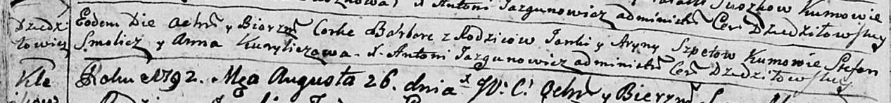
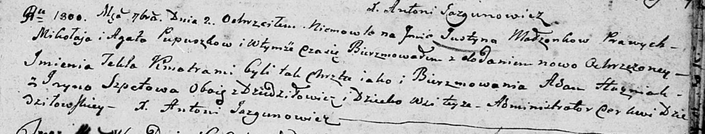

**Шпет (Слабковская) Арына (Szpetowa Aryna, Ryna, Jryna)**

12 сентября 1791 г -- венчание с Яном Шпетом с деревни Дедиловичи (НИАБ
136-13-894, лист 70, №18/1791-б (ориг)).

22 августа 1792 г -- крещение дочери Варвары (НИАБ 136-13-894, лист
16об, №50/1792-р (ориг)).

15 июля 1795 г -- крещение сына Габриэля (НИАБ 136-13-894, лист 24об,
№19/1795-р (ориг)), (РГИА 823-2-18, лист 252об, №16/1795-р (коп)).

2 сентября 1800 г -- крестная мать Юстыны Текли, дочери Пупушков Миколая
и Агаты с деревни Дедиловичи (НИАБ 136-13-894, лист 42, №23/1800-р
(ориг), НИАБ 136-13-949, лист 103об, №26/1800-р (коп)).

25 ноября 1802 г -- крестная мать Георгия, сына Миколая и Агаты Пупушков
с деревни Дедиловичи (НИАБ 937-4-32, лист 8, №42/1802-р).

20 июля 1803 г -- крещение дочери Магдалены Катерыны (НИАБ 136-13-894,
лист 51, №29/1803-р (ориг)).

**НИАБ 136-13-894:** Лист 70. **Метрическая запись №18/1791-б (ориг).**

Дедиловичская Покровская церковь. 12 сентября 1791 года. Метрическая
запись о венчании.

Szpet Jan -- жених, с деревни Дедиловичи.

Słabkowska Aryna -- невеста, вдова, с деревни Дедиловичи.

Wasilewski Jan -- свидетель.

Larczonek Jerzy -- свидетель.

Jazgunowicz Antoni -- ксёндз.

**НИАБ 136-13-894:** Лист 16об. **Метрическая запись №50/1792-р
(ориг).**

Дедиловичская Покровская церковь. 22 августа 1792 года. Метрическая
запись о крещении.

Szpetowna Barbara -- дочь родителей с деревни Дедиловичи.

Szpet Janka -- отец.

Szpetowa Aryna -- мать.

Smolicz Stefan - кум.

Kuryliczowa Anna - кума.

Jazgunowicz Antoni -- ксёндз.

**НИАБ 136-13-894:** Лист 24-об. **Метрическая запись №19/1795-р
(ориг).**

Дедиловичская Покровская церковь. 15 июля 1795 года. Метрическая запись
о крещении.

Szpet Gabriel -- сын родителей с деревни Дедиловичи.

Szpet Janka -- отец.

Szpetowa Ryna -- мать.

Smolicz Stefan - кум.

Kuryliczowa Anna - кума.

Jazgunowicz Antoni -- ксёндз.

**РГИА 823-2-18:** Лист 252об. **Метрическая запись №16/1795-р (коп).**

Дедиловичская Покровская церковь. 15 июля 1795 года. Метрическая запись
о крещении.

Szpet Gabriel -- сын родителей с деревни Дедиловичи.

Szpet Janka -- отец.

Szpetowa Aryna -- мать.

Smolicz Stefan -- кум.

Kuryliczowa Anna -- кума.

Jazgunowicz Antoni -- ксёндз.

**НИАБ 136-13-894:** Лист 42. **Метрическая запись №23/1800-р (ориг).**

Дедиловичская Покровская церковь. 2 сентября 1800 года. Метрическая
запись о крещении.

Pupuszkowna Justyna Tekla -- дочь родителей с деревни Дедиловичи.

Pupuszko Mikołay -- отец.

Pupuszkowa Agata -- мать.

Huzniak Adam -- кум, с деревни Дедиловичи.

Szpetowa Jryna -- кума, с деревни Дедиловичи.

Jazgunowicz Antoni -- ксёндз.

**НИАБ 836-13-949:** Лист 103об. **Метрическая запись №26/1800-р
(коп).**

(См. тж.: НИАБ 136-13-894, лист 42, №23/1800-р (ориг))

Дедиловичская Покровская церковь. 2 сентября 1800 года. Метрическая
запись о крещении.

Pupuszka Justyn Teofil \[Justyna Tekla\] -- сын \[дочь\] родителей с
деревни Дедиловичи.

Pupuszka Mikołay -- отец.

Pupuszkowa Agata -- мать.

Huzniak Adam -- кум, с деревни Дедиловичи.

Szpetowa Jryna - кума, с деревни Дедиловичи.

Jazgunowicz Antoni -- ксёндз.

**НИАБ 937-4-32:** Лист 8. **Метрическая запись №42/1802-р.**

Дедиловичский костел Наисвятейшего Сердца Иисуса. 25 ноября 1802 года.
Метрическая запись о крещении.

Popuszka Georgi -- сын крестьян с деревни Дедиловичи.

Popuszka Nicołay -- отец.

Popuszkowa Agatha -- мать.

Huzniak Adam -- крестный отец.

Szpetowa Aryna -- крестная мать, с деревни Дедиловичи.

Linhart Hyacinthus -- ксёндз.

**НИАБ 136-13-894:** Лист 51. **Метрическая запись №29/1803-р (ориг).**

Дедиловичская Покровская церковь. 20 июля 1803 года. Метрическая запись
о крещении.

Szpetowna Magdalena Katerzyna -- дочь родителей с деревни Дедиловичи.

Szpet Jan -- отец.

Szpetowa Ryna -- мать.

Smolicz Stefan -- кум.

Kuryliwiczowa Anna -- кума.

Jazgunowicz Antoni -- ксёндз.
