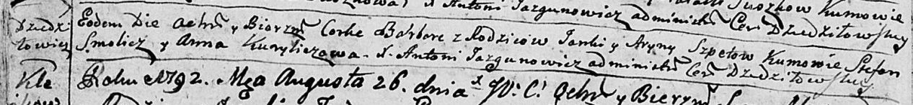

**Шпет Варвара Янкова (Szpetowna Barbara)**

22 августа 1792 г -- крещение (НИАБ 136-13-894, лист 16об, №50/1792-р
(ориг)).

**НИАБ 136-13-894:** Лист 16об. **Метрическая запись №50/1792-р
(ориг).**

Дедиловичская Покровская церковь. 22 августа 1792 года. Метрическая
запись о крещении.

Szpetowna Barbara -- дочь родителей с деревни Дедиловичи.

Szpet Janka -- отец.

Szpetowa Aryna -- мать.

Smolicz Stefan - кум.

Kuryliczowa Anna - кума.

Jazgunowicz Antoni -- ксёндз.
