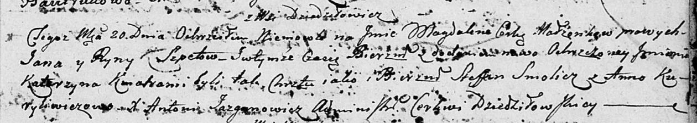

**Шпет Магдалена Янкова (Szpetowna Magdalena Katerzyna)**

20 июля 1803 г -- крещение (НИАБ 136-13-894, лист 51, №29/1803-р
(ориг)).

**НИАБ 136-13-894:** Лист 51. **Метрическая запись №29/1803-р (ориг).**

Дедиловичская Покровская церковь. 20 июля 1803 года. Метрическая запись
о крещении.

Szpetowna Magdalena Katerzyna -- дочь родителей с деревни Дедиловичи.

Szpet Jan -- отец.

Szpetowa Ryna -- мать.

Smolicz Stefan -- кум.

Kuryliwiczowa Anna -- кума.

Jazgunowicz Antoni -- ксёндз.
