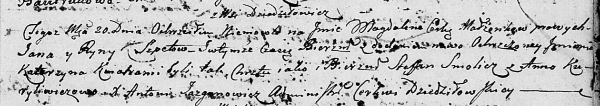

**Шпет Янка (Szpet Janka, Jan)**

12 сентября 1791 г -- венчание со вдовой Арыной Слабковской с деревни
Дедиловичи (НИАБ 136-13-894, лист 70, №18/1791-б (ориг)).

15 июля 1795 г -- крещение сына Габриэля (НИАБ 136-13-894, лист 24об,
№19/1795-р (ориг)), (РГИА 823-2-18, лист 252об, №16/1795-р (коп)).

20 июля 1803 г -- крещение дочери Магдалены Катерыны (НИАБ 136-13-894,
лист 51, №29/1803-р (ориг)).

**НИАБ 136-13-894:** Лист 70. **Метрическая запись №18/1791-б (ориг).**

Дедиловичская Покровская церковь. 12 сентября 1791 года. Метрическая
запись о венчании.

Szpet Jan -- жених, с деревни Дедиловичи.

Słabkowska Aryna -- невеста, вдова, с деревни Дедиловичи.

Wasilewski Jan -- свидетель.

Larczonek Jerzy -- свидетель.

Jazgunowicz Antoni -- ксёндз.

**НИАБ 136-13-894:** Лист 24-об. **Метрическая запись №19/1795-р
(ориг).**

Дедиловичская Покровская церковь. 15 июля 1795 года. Метрическая запись
о крещении.

Szpet Gabriel -- сын родителей с деревни Дедиловичи.

Szpet Janka -- отец.

Szpetowa Ryna -- мать.

Smolicz Stefan - кум.

Kuryliczowa Anna - кума.

Jazgunowicz Antoni -- ксёндз.

**РГИА 823-2-18:** Лист 252об. **Метрическая запись №16/1795-р (коп).**

Дедиловичская Покровская церковь. 15 июля 1795 года. Метрическая запись
о крещении.

Szpet Gabriel -- сын родителей с деревни Дедиловичи.

Szpet Janka -- отец.

Szpetowa Aryna -- мать.

Smolicz Stefan -- кум.

Kuryliczowa Anna -- кума.

Jazgunowicz Antoni -- ксёндз.

**НИАБ 136-13-894:** Лист 51. **Метрическая запись №29/1803-р (ориг).**

Дедиловичская Покровская церковь. 20 июля 1803 года. Метрическая запись
о крещении.

Szpetowna Magdalena Katerzyna -- дочь родителей с деревни Дедиловичи.

Szpet Jan -- отец.

Szpetowa Ryna -- мать.

Smolicz Stefan -- кум.

Kuryliwiczowa Anna -- кума.

Jazgunowicz Antoni -- ксёндз.
