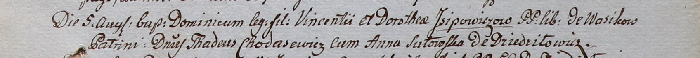

**Шустовская Анна (Szutowska Anna)**

10 июня 1800 г -- крестная мать Антона, сына Кирилла и Марцеллы
Рапацевичей с деревни Дедиловичи (НИАБ 937-4-32, лист 2, №19/1800-р).

18 июля 1800 г -- крестная мать Сымона, сына Михаила и Анны Кушнеревичей
с деревни Дедиловичи (НИАБ 937-4-32, лист 2, №22/1800-р (ориг)).

5 августа 1800 г -- крестная мать Доминика, сына Винцентия и Доротей
Исиповичей с деревни Васильковка (НИАБ 937-4-32, лист 2, №24/1800-р).

**НИАБ 937-4-32:** Лист 2. **Метрическая запись №19/1800-р.**

{width="6.496527777777778in"
height="0.6576388888888889in"}

Дедиловичский костел Наисвятейшего Сердца Иисуса. 10 июня 1800 года.
Метрическая запись о крещении.

Rapacewicz Antoni -- сын крестьян с деревни Дедиловичи.

Rapacewicz Cirili -- отец.

Rapacewiczowa Marcella -- мать.

Rudnicki Joseph -- крестный отец, с деревни Дедиловичи.

Sutowska Anna -- крестная мать, с деревни Дедиловичи.

Linhart Hyacinthus -- ксёндз.

**НИАБ 937-4-32:** Лист 2. **Метрическая запись №22/1800-р.**

{width="6.496527777777778in"
height="0.7423611111111111in"}

Дедиловичский костел Наисвятейшего Сердца Иисуса. 18 июля 1800 года.
Метрическая запись о крещении.

Kusznierewicz Simon -- сын крестьян с деревни Дедиловичи.

Kusznierewicz Michael -- отец.

Kusznierewiczowa Anna -- мать.

Odyniec Romuald -- крестный отец, шляхтич.

Sutowska Anna -- крестная мать, с деревни Дедиловичи.

Linhart Hyacinthus -- ксёндз.

**НИАБ 937-4-32.** Лист 2. **Метрическая запись №24/1800-р.**

{width="6.496527777777778in"
height="0.5513888888888889in"}

Дедиловичский костел Наисвятейшего Сердца Иисуса. 5 августа 1800 года.
Метрическая запись о крещении.

Jsjpowicz Dominic -- сын вольных людей с деревни Васильковка.

Jsjpowicz Vincenti -- отец.

Jsjpowiczowa Dorothea -- мать.

Chodasewicz Thadeusz -- крестный отец, шляхтич, с деревни Дедиловичи.

Sutowska Anna -- крестная мать, с деревни Дедиловичи.

Linhart Hyacinthus -- ксёндз.
