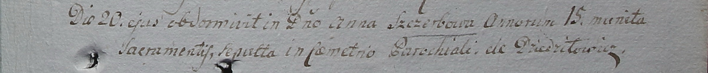

**Щербо Анна (Szczerbowa Anna)**

20 декабря 1799 г -- отпевание, умерла в возрасте 15 лет (родилась около
1784 г) (НИАБ 1781-27-199, лист 131, №24/1799-у).

**НИАБ 1781-27-199:** Лист 131. **Метрическая запись №24/1799-у.**

Дедиловичский костел Наисвятейшего Сердца Иисуса. 20 декабря 1799 года.
Метрическая запись об отпевании.

Szczerbowa Anna -- умершая, 15 лет, с деревни Дедиловичи.

Linhart Hyacinthus -- ксёндз.
