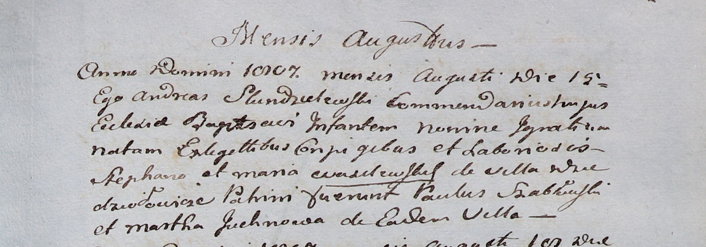

**Юхнович Марта (Juchnowa Martha)**

15 августа 1807 г -- крестная мать Игнатия, сына Стефана и Марьяны
Василевских с деревни Дедиловичи (НИАБ 937-4-32, лист 16, №14/1807-р).

**НИАБ 937-4-32:** Лист 16. **Метрическая запись №14/1807-р.**

{width="6.496527777777778in"
height="2.2743055555555554in"}

Дедиловичский костел Наисвятейшего Сердца Иисуса. 15 августа 1807 года.
Метрическая запись о крещении.

Wasilewski Jgnati -- сын крестьян с деревни Дедиловичи.

Wasilewski Stephan -- отец.

Wasilewska Maria -- мать.

Szabłowski Paul -- крестный отец.

Juchnowa Martha -- крестная мать, с деревни Дедиловичи.

Scindzelewski Andreas -- ксёндз, викарий Дедиловичский.
