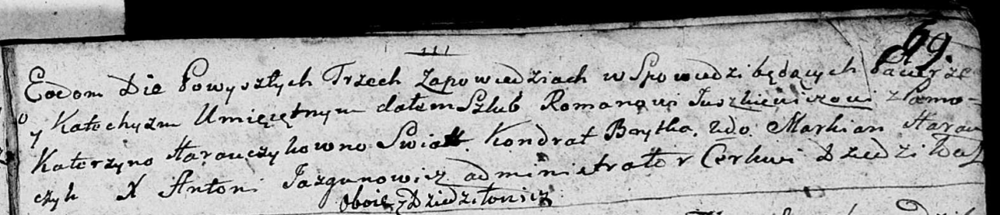

**Юшкевич Роман (Juszkiewicz Roman)**

27 октября 1790 г -- венчание с Катерыной Горавчик (НИАБ 136-13-894,
лист 69, №11/1790-б (ориг)).

**НИАБ 136-13-894:** Лист 69. **Метрическая запись №11/1790-б (ориг).**

{width="6.496527777777778in"
height="1.4006856955380578in"}

Дедиловичская Покровская церковь. 27 октября 1790 года. Метрическая
запись о венчании.

Juszkiewicz Roman -- жених, с деревни Дедиловичи.

Harauczykowna Katerzyna -- невеста, с деревни Дедиловичи.

Brytka Kondrat -- свидетель.

Harauczyk Markian -- свидетель.

Jazgunowicz Antoni -- ксёндз.
