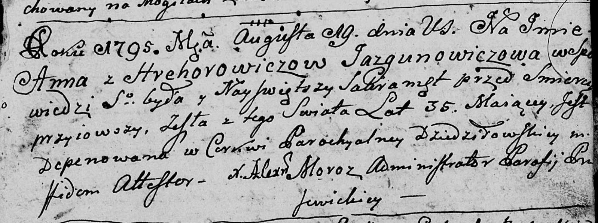

**Язгунович Агата Антонова, шляхтянка (Jazgunowiczowna Agata, JP)**

13 февраля 1788 г -- крещение (НИАБ 136-13-894, лист 4, №21/1788-р
(ориг)).

**НИАБ 136-13-894:** Лист 4. **Метрическая запись №21/1788-р (ориг).**

{width="6.496527777777778in"
height="1.1921587926509187in"}

Дедиловичская Покровская церковь. 13 февраля 1788 года. Метрическая
запись о крещении.

Jazgunowiczowna Agata -- дочь родителей с деревни Дедиловичи, шляхтянка.

Jazgunowicz Antoni, JP -- отец, шляхтич.

Jazgunowiczowa Anna -- мать, шляхтянка.

Siemaszko Symon?, WJP -- кум, шляхтич.

Weryhina Elena -- кума.

Dowgiel Andrzej - ассистент.

Żukowska ? - ассистентка.

Szyłowa Marcella - кума.

Weryho Michal -- ксёндз с церкви Прусевичской.
