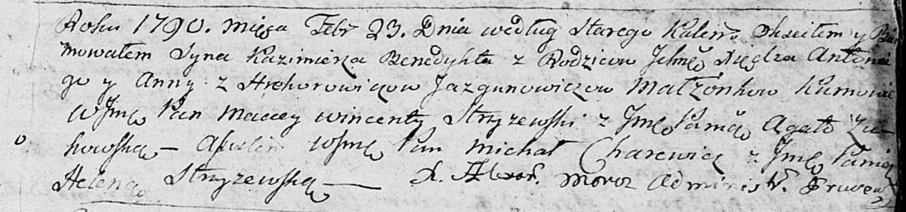

**Язгунович Анна (Грегорович), шляхтянка (Jazgunowiczowna Anna z
Hrehorowiczow, JP)**

21 мая 1783 г -- кума у сына Изыдора Кузьмы и Юстины Сушко (РГИА
823-2-18, лист 224, №13/1783-р (коп)).

13 февраля 1788 г -- крещение дочери Агаты (НИАБ 136-13-894, лист 4,
№21/1788-р (ориг)).

23 февраля 1790 г -- крещение сына Казимира (НИАБ 136-13-894, лист 9,
№13/1790-р (ориг)).

1 апреля 1791 г -- крещение дочери Богумилы (НИАБ 136-13-894, лист 12об,
№15/1791-р (ориг)).

19 августа 1795 г -- отпевание, умерла в возрасте 35 лет (родилась около
1760 г) (НИАБ 136-13-919, лист 5, №28/1795-у (ориг)).

**РГИА 823-2-18:** Лист 224. **Метрическая запись №13/1783-р (коп).**

{width="6.496527777777778in"
height="1.5784722222222223in"}

Дедиловичская Покровская церковь. 21 мая 1783 года. Метрическая запись о
крещении.

Suszko Jzydor -- сын.

Suszko Kuźma -- отец.

Suszkowa Justyna -- мать.

Laszkiewicz Leon, JP -- кум, шляхтич.

Jazgunowiczowna Anna, JP -- кума, шляхтянка.

Jazgunowicz Antoni -- ксёндз.

**НИАБ 136-13-894:** Лист 4. **Метрическая запись №21/1788-р (ориг).**

{width="6.496527777777778in"
height="1.1921587926509187in"}

Дедиловичская Покровская церковь. 13 февраля 1788 года. Метрическая
запись о крещении.

Jazgunowiczowna Agata -- дочь родителей с деревни Дедиловичи, шляхтянка.

Jazgunowicz Antoni, JP -- отец, шляхтич.

Jazgunowiczowa Anna -- мать, шляхтянка.

Siemaszko Symon?, WJP -- кум, шляхтич.

Weryhina Elena -- кума.

Dowgiel Andrzej - ассистент.

Żukowska ? - ассистентка.

Szyłowa Marcella - кума.

Weryho Michal -- ксёндз с церкви Прусевичской.

**НИАБ 136-13-894:** Лист 9. **Метрическая запись №13/1790-р (ориг).**

{width="6.496527777777778in"
height="1.5254002624671916in"}

Дедиловичская Покровская церковь. 23 февраля 1790 года по старому
календарю. Метрическая запись о крещении.

Jazgunowicz Kazimierz Benedykt, JP -- сын шляхетных родителей с деревни
Дедиловичи.

Jazgunowicz Antonij, JP -- отец, шляхтич, ксёндз, администратор церкви
Дедиловичской.

Jazgunowiczowa z Hrehorowiczow Anna, JP -- мать, шляхтянка.

Stryżewski? Maciey Wincenty, WJP -- кум, шляхтич.

Żukowska Agata, JP -- кума, шляхтянка.

Charewicz Michał, WJP -- ассистент, шляхтич.

Stryżewska Helena, JP -- ассистентка, шляхтянка.

Moroz Alexander? -- ксёндз, администратор церкви Прусевичской.

**НИАБ 136-13-894:** Лист 12об. **Метрическая запись №15/1791-р
(ориг).**

{width="6.496527777777778in"
height="1.4362226596675416in"}

Дедиловичская Покровская церковь. 1 апреля 1791 года. Метрическая запись
о крещении.

С Дедилович.

Jazgunowiczowna Bogumila, JP -- дочь ксёндза с деревни Дедиловичи,
шляхтянка.

Jazgunowicz Antonij, JP -- отец, шляхтич.

Jazgunowiczowa Anna z Hrehorowiczow, JP -- мать, шляхтянка.

Pohoski Thadeusz, JP -- кум, шляхтич.

Żukowska Agata, JP -- кума, шляхтянка.

Okołłowicz T. -- ксёндз костела Прусевичского.

**НИАБ 136-13-919:** Лист 5. **Метрическая запись №28/1795-у (ориг).**

{width="6.496527777777778in"
height="2.433333333333333in"}

Дедиловичская Покровская церковь. 19 августа 1795 года. Метрическая
запись об отпевании.

Jazgunowiczowa z Hrehorowiczow Anna -- умершая, 35 лет, с деревни
Дедиловичи, похоронена в церкви Дедиловичской.

Moroz Alexander -- ксёндз, проводивший таинства, администратор
Прусевичской церкви.
