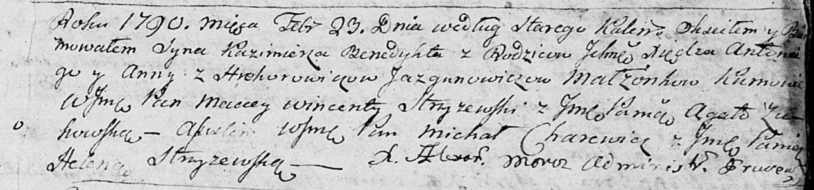

**Язгунович Казимир Антонов, шляхтич (Jazgunowicz Kazimierz Benedykt,
JP)**

23 февраля 1790 г -- крещение (НИАБ 136-13-894, лист 9, №13/1790-р
(ориг)).

**НИАБ 136-13-894:** Лист 9. **Метрическая запись №13/1790-р (ориг).**

Дедиловичская Покровская церковь. 23 февраля 1790 года по старому
календарю. Метрическая запись о крещении.

Jazgunowicz Kazimierz Benedykt, JP -- сын шляхетных родителей с деревни
Дедиловичи.

Jazgunowicz Antonij, JP -- отец, шляхтич, ксёндз, администратор церкви
Дедиловичской.

Jazgunowiczowa z Hrehorowiczow Anna, JP -- мать, шляхтянка.

Stryżewski? Maciey Wincenty, WJP -- кум, шляхтич.

Żukowska Agata, JP -- кума, шляхтянка.

Charewicz Michał, WJP -- ассистент, шляхтич.

Stryżewska Helena, JP -- ассистентка, шляхтянка.

Moroz Alexander? -- ксёндз, администратор церкви Прусевичской.
