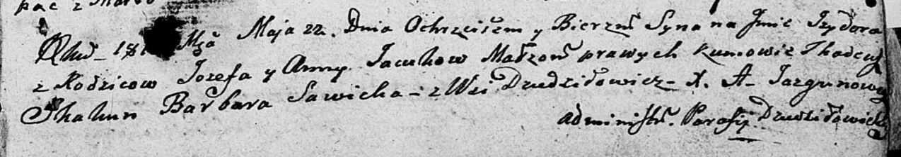

**Яцук Изыдор Иосифов (Jacuk Jzydor)**

22 мая 1810 г -- крещение (НИАБ 136-13-894, лист 77, №16/1810-р (ориг)).

**НИАБ 136-13-894:** Лист 77. **Метрическая запись №16/1810-р (ориг).**

Дедиловичская Покровская церковь. 22 мая 1810 года. Метрическая запись о
крещении.

Jacuk Jzydor -- сын родителей с деревни Дедиловичи.

Jacuk Jozef -- отец.

Jacukowa Anna -- мать.

Skakun Tadeusz -- кум.

Sawicka Barbara -- кума.

Jazgunowicz Antoni -- ксёндз.
