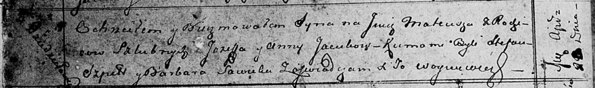

**Яцук Иосиф (Jacuk Jozef)**

22 мая 1810 г -- крещение сына Изыдора (НИАБ 136-13-894, лист 77,
№16/1810-р (ориг)).

20 апреля 1813 г -- крещение сына Матея (НИАБ 136-13-894, лист 86об,
№10/1813-р (ориг)).

**НИАБ 136-13-894:** Лист 77. **Метрическая запись №16/1810-р (ориг).**

{width="6.496527777777778in"
height="1.1425415573053368in"}

Дедиловичская Покровская церковь. 22 мая 1810 года. Метрическая запись о
крещении.

Jacuk Jzydor -- сын родителей с деревни Дедиловичи.

Jacuk Jozef -- отец.

Jacukowa Anna -- мать.

Skakun Tadeusz -- кум.

Sawicka Barbara -- кума.

Jazgunowicz Antoni -- ксёндз.

**НИАБ 136-13-894:** Лист 86об. **Метрическая запись №10/1813-р
(ориг).**

{width="6.496527777777778in"
height="0.9648578302712161in"}

Осовская Покровская церковь. 20 апреля 1813 года. Метрическая запись о
крещении.

Jacuk Mateusz -- сын родителей с деревни Дедиловичи.

Jacuk Jozef -- отец.

Jacukowa Anna -- мать.

Szpet Stefan -- кум.

Sawicka Barbara -- кума.

Woyniewicz Tomasz -- ксёндз.
