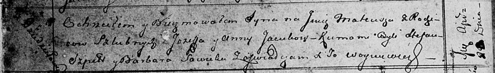

**Яцук Матей Иосифов (Jacuk Mateusz)**

20 апреля 1813 г -- крещение (НИАБ 136-13-894, лист 86об, №10/1813-р
(ориг)).

**НИАБ 136-13-894:** Лист 86об. **Метрическая запись №10/1813-р
(ориг).**

Осовская Покровская церковь. 20 апреля 1813 года. Метрическая запись о
крещении.

Jacuk Mateusz -- сын родителей с деревни Дедиловичи.

Jacuk Jozef -- отец.

Jacukowa Anna -- мать.

Szpet Stefan -- кум.

Sawicka Barbara -- кума.

Woyniewicz Tomasz -- ксёндз.
