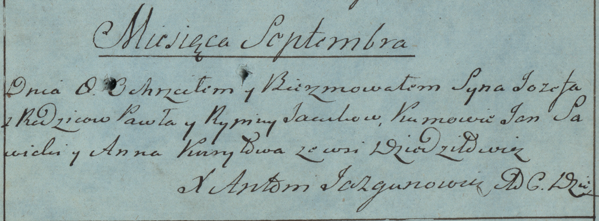

**Яцук Иосиф Павлов (Jacuk Jozef)**

8 сентября 1782г -- крещение (РГИА 823-2-18, лист 222, №4/1782-р (коп)).

**РГИА 823-2-18:** Лист 222. **Метрическая запись №4/1782-р (коп).**

{width="6.496527777777778in"
height="2.4027777777777777in"}

Дедиловичская униатская церковь. 8 сентября 1782 года. Метрическая
запись о крещении.

Jacuk Jozef -- сын родителей с деревни Дедиловичи.

Jacuk Paweł -- отец.

Jacukowa Rypina -- мать.

Sawicki Jan -- кум.

Kuryłowa Anna - кума.

Jazgunowicz Antoni -- ксёндз.
