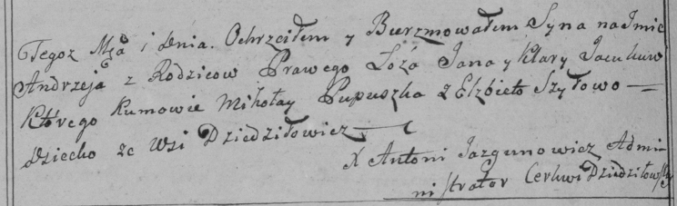

**Яцук Андрей Янов (Jacuk Andrzey Kiryak)**

5 июля 1799 г -- крещение (НИАБ 136-13-894, лист 39, №26/1799-р (ориг)),
(РГИА 823-2-18, лист 270об, №24/1799-р (коп), НИАБ 136-13-938, лист
242об, №25/1799-р (коп)).

**НИАБ 136-13-894:** Лист 39. **Метрическая запись №26/1799-р (ориг).**

Дедиловичская Покровская церковь. 5 июля 1799 года. Метрическая запись о
крещении.

Jacuk Andrzey -- сын родителей с деревни Дедиловичи.

Jacuk Jan -- отец.

Jacukowa Kłara -- мать.

Pupuszka Mikołay-- кум.

Szyłowa Elżbieta -- кума.

Jazgunowicz Antoni -- ксёндз.

**РГИА 823-2-18:** Лист 270об. **Метрическая запись №25/1799-р (коп).**

Дедиловичская Покровская церковь. \[5 июля\] 1799 года. Метрическая
запись о крещении.

Jacuk Andrzey -- сын родителей с деревни Дедиловичи.

Jacuk Jan -- отец.

Jacukowa Klara -- мать.

Pupuszka Mikołay -- кум.

Szyłowa Elżbieta -- кума.

Jazgunowicz Antoni -- ксёндз.

**НИАБ 136-13-938:** Лист 242об. **Метрическая запись №25/1799-р
(коп).**

(См. тж. НИАБ 136-13-894, лист 39, №26/1799-р (ориг); РГИА 823-2-18,
лист 270об, №25/1799-р (коп))

Дедиловичская Покровская церковь. 5 июля 1799 года. Метрическая запись о
крещении.

Jacuk Andrzey Kiryak -- сын родителей с деревни Дедиловичи.

Jacuk Jan -- отец.

Jacukowa Klara -- мать.

Pupuszka Mikołay -- кум, с деревни Дедиловичи.

Szyłowa Elżbieta - кума, с деревни Дедиловичи.

Jazgunowicz Antoni -- ксёндз.
