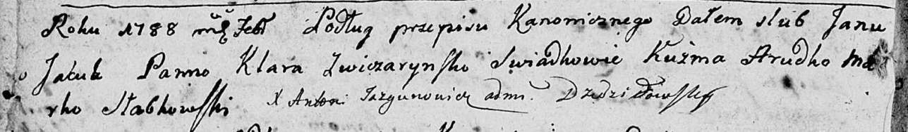

**Яцук Анна Янова (Jacukowna Anna Elżbieta)**

1 сентября 1802 г -- крещение (НИАБ 136-13-894, лист 48, №33/1802-р
(ориг)).

**НИАБ 136-13-894:** 48. **Метрическая запись №33/1802-р (ориг).**

{width="6.496527777777778in"
height="1.2860290901137357in"}

Дедиловичская Покровская церковь. 1 сентября 1802 года. Метрическая
запись о крещении.

Jacukowna Anna Elżbieta -- дочь.

Jacuk Jan -- отец.

Jacukowa Kłara -- мать.

Pupuszka Mikołay -- кум.

Szyłakowa Elżbieta -- кума.

Jazgunowicz Antoni -- ксёндз.
