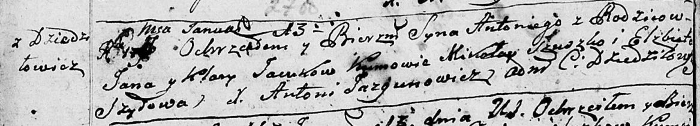
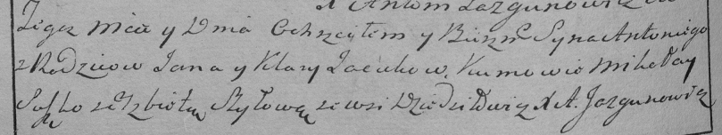

**Яцук Антон Янов (Jacuk Antoni)**

13 января 1796 г -- крещение (НИАБ 136-13-894, лист 27об, №6/1796-р
(ориг)), (РГИА 823-2-18, лист 254об, №5/1796-р (коп)).

**НИАБ 136-13-894:** Лист 27об. **Метрическая запись №6/1796-р (ориг).**

Дедиловичская Покровская церковь. 13 января 1796 года. Метрическая
запись о крещении.

Jacuk Antoni -- сын родителей с деревни Дедиловичи.

Jacuk Jan -- отец.

Jacukowa Kłara -- мать.

Szuszko Mikołay - кум.

Szyłowa Elżbieta - кума.

Jazgunowicz Antoni -- ксёндз.

**РГИА 823-2-18:** Лист 254об. **Метрическая запись №5/1796-р (коп).**

Дедиловичская Покровская церковь. \[13\] января 1796 года. Метрическая
запись о крещении.

Jacuk Antoni -- сын родителей с деревни Дедиловичи.

Jacuk Jan -- отец.

Jacukowa Klara -- мать.

Suszko Mikołay -- кум.

Szyłowa Elżbieta -- кума.

Jazgunowicz Antoni -- ксёндз.
