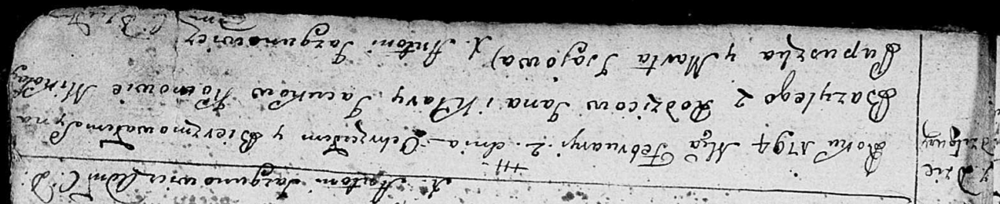
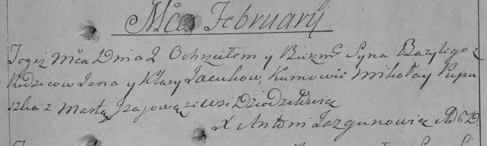

**Яцук Базыль Янов (Jacuk Bazyli)**

2 февраля 1794 г -- крещение (НИАБ 136-13-894, лист 21, №7/1794-р
(ориг)), (РГИА 823-2-18, лист 249, №5/1794-р (коп)).

**НИАБ 136-13-894:** Лист 21. **Метрическая запись №7/1794-р (ориг).**

Дедиловичская Покровская церковь. 2 февраля 1794 года. Метрическая
запись о крещении.

Jacuk Bazyli -- сын родителей с деревни Дедиловичи.

Jacuk Jan -- отец.

Jacukowa Klara -- мать.

Pupuszka Mikołay - кум.

Jsajowa Marta - кума.

Jazgunowicz Antoni -- ксёндз.

**РГИА 823-2-18:** Лист 249. **Метрическая запись №5/1794-р (коп).**

Дедиловичская Покровская церковь. 2 февраля 1794 года. Метрическая
запись о крещении.

Jacuk Bazyli -- сын родителей с деревни Дедиловичи.

Jacuk Jan -- отец.

Jacukowa Klara -- мать.

Pupuszka Mikołay -- кум.

Jsajowa Marta -- кума.

Jazgunowicz Antoni -- ксёндз.
