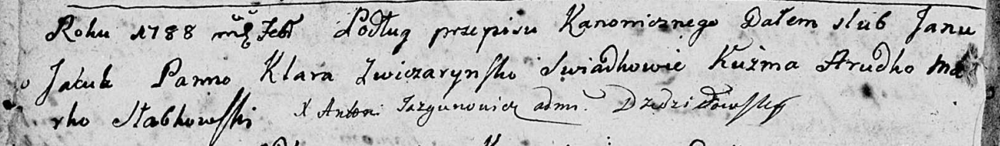
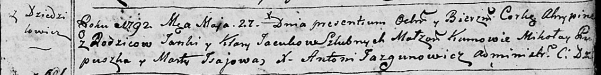
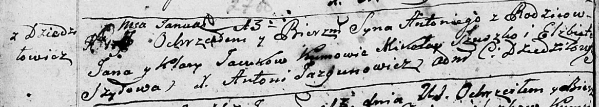
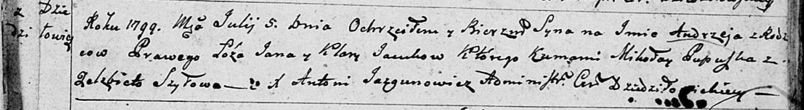
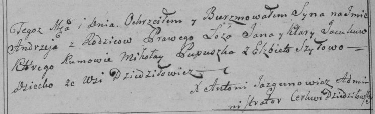
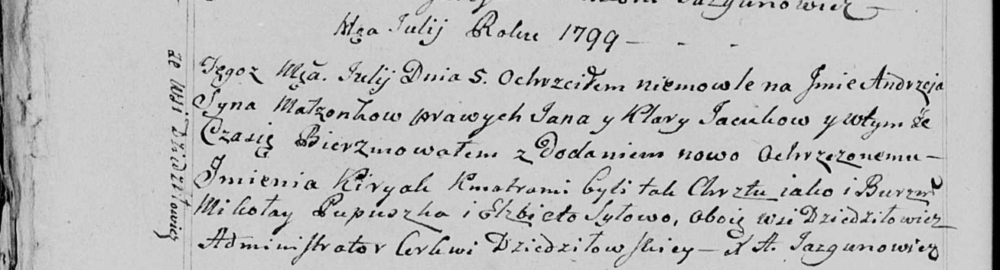
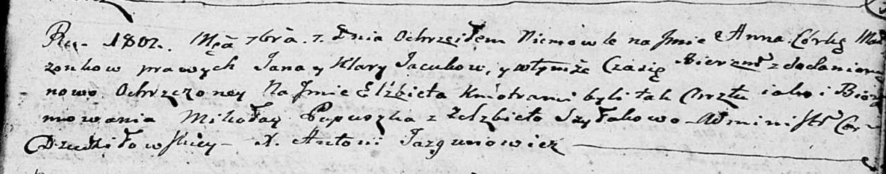

**Яцук (Звичаринская) Клара (Jacukowa Kłara z Zwiczarinskich)**

2 февраля 1788 г -- венчание с Яном Яцуком (НИАБ 136-13-894, лист 66об,
№3/1788-б (ориг)).

27 мая 1792 г -- крещение дочери Агрыпины (НИАБ 136-13-894, лист 16,
№29/1792-р (ориг)).

2 февраля 1794 г -- крещение сына Базыля (НИАБ 136-13-894, лист 21,
№7/1794-р (ориг)), (РГИА 823-2-18, лист 249, №5/1794-р (коп)).

13 января 1796 г -- крещение сына Антона (НИАБ 136-13-894, лист 27об,
№6/1796-р (ориг)), (РГИА 823-2-18, лист 254об, №5/1796-р (коп)).

5 июля 1799 г -- крещение сына Андрея (НИАБ 136-13-894, лист 39,
№26/1799-р (ориг)), (РГИА 823-2-18, лист 270об, №24/1799-р (коп), НИАБ
136-13-938, лист 242об, №25/1799-р (коп)).

1 сентября 1802 г -- крещение дочери Анны Елисаветы (НИАБ 136-13-894,
лист 48, №33/1802-р (ориг)).

**НИАБ 136-13-894:** Лист 66об. **Метрическая запись №3/1788-б (ориг).**

Дедиловичская Покровская церковь. 2 февраля 1788 года. Метрическая
запись о венчании.

Jacuk Jan -- жених с деревни \[Дедиловичи\].

Zwiczarynska Kłara -- невеста.

Hrudko Kuźma -- свидетель.

Słabkowski Marko -- свидетель.

Jazgunowicz Antoni -- ксёндз.

**НИАБ 136-13-894:** Лист 16. **Метрическая запись №29/1792-р (ориг).**

Дедиловичская Покровская церковь. 27 мая 1792 года. Метрическая запись о
крещении.

Jacukowna Ahrypina -- дочь родителей с деревни Дедиловичи.

Jacuk Janka -- отец.

Jacuk Kłara -- мать.

Pupuszka Mikołay - кум.

Jsajowa Marta - кума.

Jazgunowicz Antoni -- ксёндз.

**НИАБ 136-13-894:** Лист 21. **Метрическая запись №7/1794-р (ориг).**

Дедиловичская Покровская церковь. 2 февраля 1794 года. Метрическая
запись о крещении.

Jacuk Bazyli -- сын родителей с деревни Дедиловичи.

Jacuk Jan -- отец.

Jacukowa Klara -- мать.

Pupuszka Mikołay - кум.

Jsajowa Marta - кума.

Jazgunowicz Antoni -- ксёндз.

**РГИА 823-2-18:** Лист 249. **Метрическая запись №5/1794-р (коп).**

Дедиловичская Покровская церковь. 2 февраля 1794 года. Метрическая
запись о крещении.

Jacuk Bazyli -- сын родителей с деревни Дедиловичи.

Jacuk Jan -- отец.

Jacukowa Klara -- мать.

Pupuszka Mikołay -- кум.

Jsajowa Marta -- кума.

Jazgunowicz Antoni -- ксёндз.

**НИАБ 136-13-894:** Лист 27об. **Метрическая запись №6/1796-р (ориг).**

Дедиловичская Покровская церковь. 13 января 1796 года. Метрическая
запись о крещении.

Jacuk Antoni -- сын родителей с деревни Дедиловичи.

Jacuk Jan -- отец.

Jacukowa Kłara -- мать.

Szuszko Mikołay - кум.

Szyłowa Elżbieta - кума.

Jazgunowicz Antoni -- ксёндз.

**РГИА 823-2-18:** Лист 254об. **Метрическая запись №5/1796-р (коп).**

Дедиловичская Покровская церковь. \[13\] января 1796 года. Метрическая
запись о крещении.

Jacuk Antoni -- сын родителей с деревни Дедиловичи.

Jacuk Jan -- отец.

Jacukowa Klara -- мать.

Suszko Mikołay -- кум.

Szyłowa Elżbieta -- кума.

Jazgunowicz Antoni -- ксёндз.

**НИАБ 136-13-894:** Лист 39. **Метрическая запись №26/1799-р (ориг).**

Дедиловичская Покровская церковь. 5 июля 1799 года. Метрическая запись о
крещении.

Jacuk Andrzey -- сын родителей с деревни Дедиловичи.

Jacuk Jan -- отец.

Jacukowa Kłara -- мать.

Pupuszka Mikołay-- кум.

Szyłowa Elżbieta -- кума.

Jazgunowicz Antoni -- ксёндз.

**РГИА 823-2-18:** Лист 270об. **Метрическая запись №25/1799-р (коп).**

Дедиловичская Покровская церковь. \[5 июля\] 1799 года. Метрическая
запись о крещении.

Jacuk Andrzey -- сын родителей с деревни Дедиловичи.

Jacuk Jan -- отец.

Jacukowa Klara -- мать.

Pupuszka Mikołay -- кум.

Szyłowa Elżbieta -- кума.

Jazgunowicz Antoni -- ксёндз.

**НИАБ 136-13-938:** Лист 242об. **Метрическая запись №25/1799-р
(коп).**

(См. тж. НИАБ 136-13-894, лист 39, №26/1799-р (ориг); РГИА 823-2-18,
лист 270об, №25/1799-р (коп))

Дедиловичская Покровская церковь. 5 июля 1799 года. Метрическая запись о
крещении.

Jacuk Andrzey Kiryak -- сын родителей с деревни Дедиловичи.

Jacuk Jan -- отец.

Jacukowa Klara -- мать.

Pupuszka Mikołay -- кум, с деревни Дедиловичи.

Szyłowa Elżbieta - кума, с деревни Дедиловичи.

Jazgunowicz Antoni -- ксёндз.

**НИАБ 136-13-894:** 48. **Метрическая запись №33/1802-р (ориг).**

Дедиловичская Покровская церковь. 1 сентября 1802 года. Метрическая
запись о крещении.

Jacukowna Anna Elżbieta -- дочь.

Jacuk Jan -- отец.

Jacukowa Kłara -- мать.

Pupuszka Mikołay -- кум.

Szyłakowa Elżbieta -- кума.

Jazgunowicz Antoni -- ксёндз.
