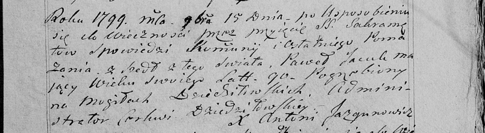

**Яцук Павел (Jacuk Paweł)**

15 сентября 1799 г -- отпевание, умер в возрасте 90 лет (родился около
1709 г) (НИАБ 136-13-919, лист 9, №17/1799-у (коп), НИАБ 136-13-938,
лист 252, №17/1799-у (коп)).

**НИАБ 136-13-919:** Лист 9. **Метрическая запись №17/1799-у (ориг).**

Дедиловичская Покровская церковь. 15 сентября 1799 года. Метрическая
запись об отпевании.

Jacuk Paweł -- умерший, 90 лет, с деревни Дедиловичи, похоронен на
кладбище деревни Дедиловичи.

Jazgunowicz Antoni -- ксёндз.

**НИАБ 136-13-938:** Лист 252. **Метрическая запись №17/1799-у (коп).**

(См. тж. НИАБ 136-13-919, Лист 9. Метрическая запись №17/1799-у (ориг))

Дедиловичская Покровская церковь. 15 ноября 1799 года. Метрическая
запись об отпевании.

Jacuk Paweł -- умерший, 90 лет, с деревни \[Дедиловичи\], похоронен на
кладбище деревни Дедиловичи.

Jazgunowicz Antoni -- ксёндз.
