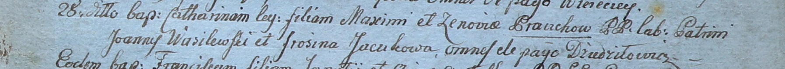

**Яцук Фросина (Jacukowa Frosina)**

28 марта 1800 г -- крестная мать Катерыны, дочери Максыма и Зыновии
Бровков с деревни Дедиловичи (НИАБ 937-4-32, лист 1, №8/1800-р).

**НИАБ 937-4-32:** Лист 1. **Метрическая запись №8/1800-р.**

Дедиловичский костел Наисвятейшего Сердца Иисуса. 28 марта 1800 года.
Метрическая запись о крещении.

Brouchowna Catharina -- дочь крестьян с деревни Дедиловичи.

Broucha Maxim -- отец.

Brouchowa Zenowia -- мать.

Wasilewski Joann -- крестный отец, с деревни Дедиловичи.

Jacukowa Frosina -- крестная мать, с деревни Дедиловичи.

Linhart Hyacinthus -- ксёндз.
