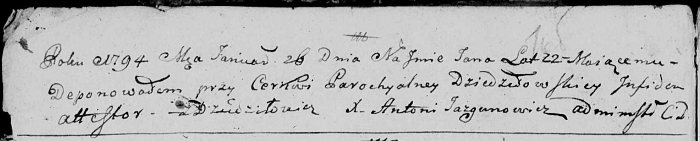

**Елена (Elena)**

30 декабря 1794 г -- отпевание, умерла в возрасте 4 года (родилась около
1790 г) (НИАБ 136-13-919, лист 3об, №58/1794-у (ориг)).

**НИАБ 136-13-919:** Лист 3об. **Метрическая запись №58/1794-у (ориг).**

{width="6.496527777777778in"
height="0.9083333333333333in"}

Дедиловичская Покровская церковь. 30 декабря 1794 года. Метрическая
запись об отпевании.

Symon -- умерший, 5 лет, с деревни Дедиловичи, похоронен на кладбище при
церкви Дедиловичской.

Elena -- умершая, 4 года, с деревни Дедиловичи, похоронена на кладбище
при церкви Дедиловичской.

Filip -- умерший, 2 года, с деревни Дедиловичи, похоронен на кладбище
при церкви Дедиловичской.

Bazyli -- умерший, 2 года, с деревни Дедиловичи, похоронен на кладбище
при церкви Дедиловичской.

Jazgunowicz Antoni -- ксёндз.
