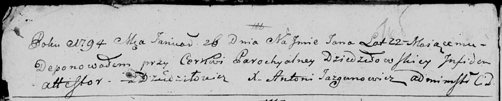

**Иосиф (Jozef)**

10 февраля 1796 г -- отпевание (НИАБ 136-13-919, лист 5об, №1/1796-у
(ориг)).

**НИАБ 136-13-919:** Лист 5об. **Метрическая запись №1/1796-у (ориг).**

{width="6.496527777777778in"
height="0.7347222222222223in"}

Дедиловичская Покровская церковь. 10 февраля 1796 года. Метрическая
запись об отпевании.

Jozef -- умерший, с деревни Дедиловичи, похоронен при церкви
Дедиловичской.

Jazgunowicz Antoni -- ксёндз.
